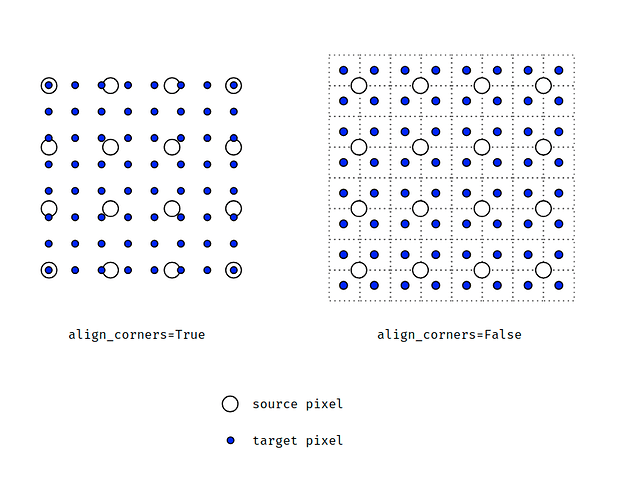
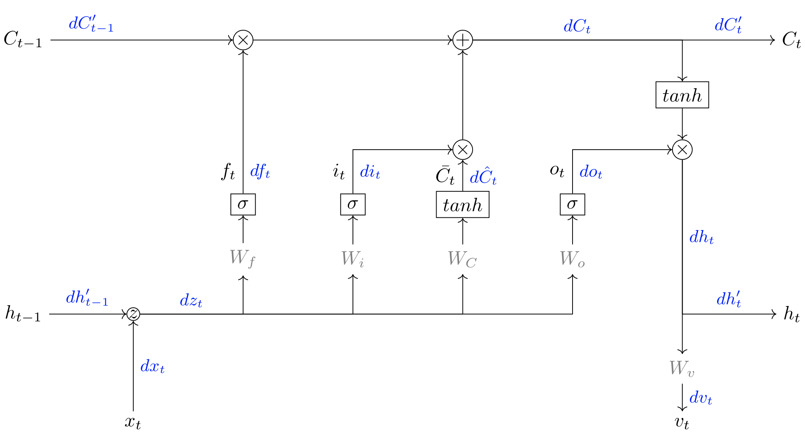

#  Awesome Python Implementation - Deep Learning (API-DL)

This repository contains a number of Python implementations in deep learning to help you with your interview, including conv2d, conv3d, interpolation, pooling, activation, LSTM, optimization, and backpropagation. 

If you have any suggestions, please feel free to contact me or directly pull the request. 

Contributed by *[Yu-Cheng Chou](johnson111788@gmail.com)*.

--- *Last updated: 08/12/2021* --- 

##  1.1. Table of Contents

- [Awesome Polyp Segmentation](#API-DL)
  - [1. Preview](#1._Preview)
    - [1.1. Table of Contents](#1.1._Table_of_Contents)
  - [2. Overview](#2._Overview)
    - [2.1. 2D Convolution](#2.1_conv2d)
    - [2.2. 3D Convolution](#2.2_conv3d)
    - [2.3. Interpolation](#2.3_interpolation)
    - [2.4. Pooling](#2.4_pooling)
    - [2.5. Activation](#2.5_activation)
    - [2.6. LSTM](#2.6_LSTM)
    - [2.7. Optimization](#2.7_Optimization)
    - [2.8. Backpropagation](#2.8_backpropagation)
    
    
## Overview

###  2.1 2D Convolution 

2D Convolution plays a key role in the development of artificial intelligence and is widely used in current research works. The inductive bias of convolution is locality and spatial invariance, i.e., the grid elements with similar space are related to each other, and the spatial invariance (shared kernel weight). The above characteristics are reflected in the code which is in `conv2d.py`.

###  2.2 3D Convolution 

Compared to 2D Convolution, 3D Convolution extends the kernel dimension to calculate temporal information which is demonstrated in `conv3d.py`.

###  2.3 Interpolation 

Interpolation aims to resize the images or feature maps. Researchers usually adopt Bilinear interpolation with `align_corners=False`. However, in semantic segmentation task, researchers set `align_corners=True`  in most cases. The difference of two settings as shown below. When align_corners is set to False, pixels are regarded as a grid of points (points at the corners are aligned). When align_corners is set to Ture, pixels are regarded as 1x1 areas (area boundaries, rather than their centers, are aligned). The python implementation in  `interpolation.py` provides the Bilinear interpolation with `align_corners=True`.

 

###  2.4 Pooling 

Pooling operation increases the receptive field, translation invariance with fewer parameters. There are max pooling and average pooling operation and this repository provides the max pooling operation in `pooling.py`.

###  2.5 Activation 

###  2.6 LSTM 

###  2.7 Optimization 

###  2.8 Backpropagation 

