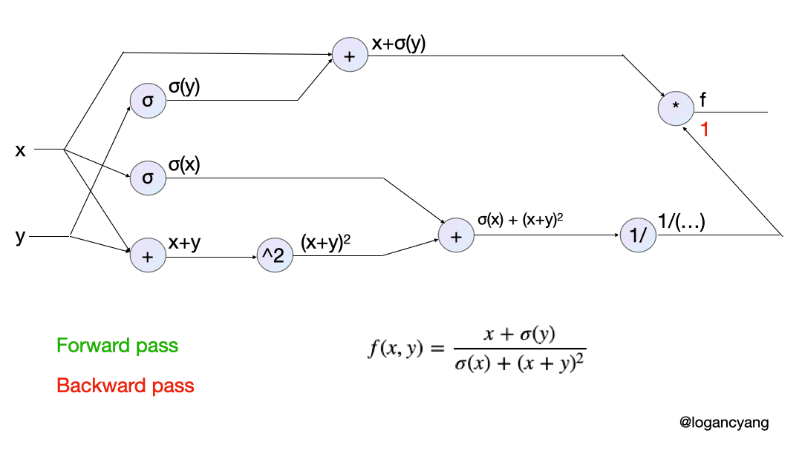

#  Awesome Python Implementation - Deep Learning (API-DL)

This project contains a number of deep learning Python implementations to help you with your interview, including conv2d, conv3d, interpolation, pooling, activation, self-attention, optimization, and backpropagation. 

If you have any suggestions, please feel free to contact me or directly pull the request. 

Contributed by *[Yu-Cheng Chou](johnson111788@gmail.com)*.

--- *Last updated: 08/12/2021* --- 

##  1.1. Table of Contents

- [Awesome Polyp Segmentation](#API-DL)
  - [1. Preview](#1._Preview)
    - [1.1. Table of Contents](#1.1._Table_of_Contents)
  - [2. Overview](#2._Overview)
    - [2.1. Convolution operation 2D](#2.)
    - [2.2. Convolution operation 3D](#2.)
    - [2.3. Interpolation](#2.)
    - [2.4. Pooling](#2.)
    - [2.5. Activation](#2.)
    - [2.6. Self-attention](#2.)
    - [2.7. Optimization](#2.)
    - [2.8. Backpropagation](#2.)
    
    
## Overview

###  2.1 Convolution operation 2D 

###  2.2 Convolution operation 3D 

###  2.3 Interpolation 

###  2.4 Pooling 

###  2.5 Activation 

###  2.6 Self-attention 

###  2.7 Optimization 

###  2.8 Backpropagation 

